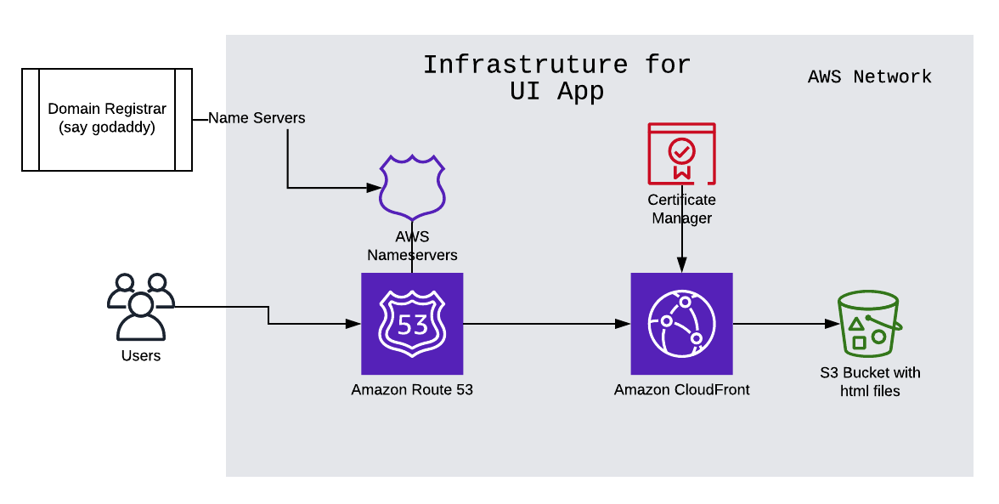

# terraform-aws-staticwebsite


[](https://github.com/RichardLitt/standard-readme)
[](http://makeapullrequest.com)

> Terraform module to host SPA UI application in AWS S3

You can read about the blog post [here](https://blog.francium.tech/how-to-serve-your-website-from-aws-s3-using-terraform-94dfd16324bf).
Note: If you find the blog/code useful, please add a clap in medium / star the github repo. Thanks in advance !!

## Table of Contents

- [terraform-aws-staticwebsite](#terraform-aws-staticwebsite)
  - [Table of Contents](#table-of-contents)
  - [Infrastructure](#infrastructure)
  - [Install](#install)
  - [Usage](#usage)
  - [Todo List](#todo-list)
  - [Maintainers](#maintainers)
  - [Contributing](#contributing)
  - [License](#license)

## Infrastructure



## Install

```
brew install terraform
```
Make sure that you have added the proper permission to create resources in AWS.

## Usage

This terraform module can be used with minimal configuration as follow,

```
module "staticwebsite" {
  source  = "worldofprasanna/staticwebsite/aws"
  version = "1.0.0"
  domain = "yourdomain.com"
}
```
Note: Please ensure that you have added the Route53 Nameservers to your Domain Registrar (say: Godaddy etc)

You can find the actual examples [here](examples/README.md)

## Todo List

- Skip the Route53 creation, if not needed
- Add examples to host the subdomain
- Add tests using Terratest
- Add contribution guidelines & Issue templates

## Maintainers

[@worldofprasanna](https://github.com/worldofprasanna)

## Contributing

PRs accepted.

Small note: If editing the README, please conform to the [standard-readme](https://github.com/RichardLitt/standard-readme) specification.

## License

MIT © 2020 Prasanna V
